# Тестування працездатності системи

## Тестування програмного забезпечення, використання JUnit test 


### Тестування **BookApiController**:

``` java
package com.fastroof.ftpr;  
  
import com.fasterxml.jackson.databind.ObjectMapper;  
import com.fastroof.ftpr.controller.BookApiController;  
import com.fastroof.ftpr.pojo.PostBookRequestPojo;  
import com.fastroof.ftpr.repository.BookFileRepository;  
import com.fastroof.ftpr.repository.BookRepository;  
import com.fastroof.ftpr.repository.CommentRepository;  
import okhttp3.*;  
import org.junit.Test;  
import org.junit.runner.RunWith;  
import org.springframework.beans.factory.annotation.Autowired;  
import org.springframework.beans.factory.annotation.Value;  
import org.springframework.boot.test.autoconfigure.web.servlet.AutoConfigureMockMvc;  
import org.springframework.boot.test.context.SpringBootTest;  
import org.springframework.test.context.TestPropertySource;  
import org.springframework.test.context.jdbc.Sql;  
import org.springframework.test.context.junit4.SpringRunner;  
import org.springframework.test.web.servlet.MockMvc;  
  
import static org.springframework.test.web.servlet.request.MockMvcRequestBuilders.*;  
import static org.springframework.test.web.servlet.result.MockMvcResultHandlers.print;  
import static org.springframework.test.web.servlet.result.MockMvcResultMatchers.content;  
import static org.springframework.test.web.servlet.result.MockMvcResultMatchers.status;  
  
  
@RunWith(SpringRunner.class)  
@SpringBootTest  
@AutoConfigureMockMvc  
@TestPropertySource("/application-test.properties")  
@Sql(value = {"/create-before-sql.sql"}, executionPhase = Sql.ExecutionPhase.BEFORE_TEST_METHOD)  
public class BookTest {  
    @Autowired  
  private MockMvc mvc;  
  
  @Autowired  
  private BookApiController controller;  
  
  @Autowired  
  private CommentRepository commentRepository;  
  
  @Autowired  
  private BookRepository bookRepository;  
  
  @Autowired  
  private BookFileRepository bookFileRepository;  
  
  
  @Test  
  public void bookList() throws Exception {  
        this.mvc.perform(get("/books"))  
                .andDo(print())  
                .andExpect(status().isOk())  
                .andExpect(content().json(objectMapper.writeValueAsString(bookRepository.findAll())));  
  }  
  
    @Test  
  public void bookById() throws Exception {  
        this.mvc.perform(get("/books/12"))  
                .andDo(print())  
                .andExpect(status().isOk())  
                .andExpect(content().json(objectMapper.writeValueAsString(bookRepository.findById(12))));  
 this.mvc.perform(get("/books/55"))  
                .andDo(print())  
                .andExpect(status().isNotFound());  
  
  }  
  
  
    @Test  
  public void postBook() throws Exception {  
        this.mvc.perform(post("/books"))  
                .andDo(print())  
                .andExpect(status().isForbidden());  
 this.mvc.perform(post("/books").header(HEADER, PREFIX + returnToken()))  
                .andDo(print())  
                .andExpect(status().isBadRequest());  
  
  PostBookRequestPojo postBookRequestPojo = new PostBookRequestPojo();  
  postBookRequestPojo.setName("Test book");  
  postBookRequestPojo.setTagId(1);  
 this.mvc.perform(post("/books").header(HEADER, PREFIX + returnToken())  
                        .content(objectMapper.writeValueAsString(postBookRequestPojo)))  
                .andDo(print())  
                .andExpect(status().isBadRequest());  
  }  
  
    @Test  
  public void patchBook() throws Exception {  
        this.mvc.perform(patch("/books/5"))  
                .andDo(print())  
                .andExpect(status().isForbidden());  
 this.mvc.perform(patch("/books/5").header(HEADER, PREFIX + returnToken()))  
                .andDo(print())  
                .andExpect(status().isBadRequest());  
  
 this.mvc.perform(patch("/books/5").header(HEADER, PREFIX + returnToken())  
                        .contentType(org.springframework.http.MediaType.APPLICATION_FORM_URLENCODED)  
                        .content("name=new_Name"))  
                .andDo(print())  
                .andExpect(status().isOk());  
  }  
  
  
    @Test  
  public void deleteBook() throws Exception {  
        this.mvc.perform(delete("/books/5"))  
                .andDo(print())  
                .andExpect(status().isForbidden());  
 this.mvc.perform(delete("/books/5").header(HEADER, PREFIX + returnToken()))  
                .andDo(print())  
                .andExpect(status().isOk());  
  
 this.mvc.perform(delete("/books/8").header(HEADER, PREFIX + returnToken()))  
                .andDo(print())  
                .andExpect(status().isForbidden());  
  }  
  
    @Test  
  public void bookComments() throws Exception {  
        this.mvc.perform(get("/books/2/comments"))  
                .andDo(print())  
                .andExpect(status().isOk())  
                .andExpect(content().json(objectMapper.writeValueAsString(commentRepository.findAllByBookId(2))));  
  
  }  
  
    @Test  
  public void bookFiles() throws Exception {  
        this.mvc.perform(get("/books/2/files"))  
                .andDo(print())  
                .andExpect(status().isOk())  
                .andExpect(content()  
                        .json(objectMapper.writeValueAsString(bookFileRepository.findAllByBookId(2))));  
  
  
 this.mvc.perform(get("/books/55/files"))  
                .andDo(print())  
                .andExpect(status().isNotFound());  
  
  
  }  
  
  
    @Test  
  public void deleteBookFile() throws Exception {  
        this.mvc.perform(delete("/books/6/files/7"))  
                .andDo(print())  
                .andExpect(status().isForbidden());  
 this.mvc.perform(delete("/books/6/files/7").header(HEADER, PREFIX + returnToken()))  
                .andDo(print())  
                .andExpect(status().isOk());  
  
 this.mvc.perform(delete("/books/99/files/7").header(HEADER, PREFIX + returnToken()))  
                .andDo(print())  
                .andExpect(status().isNotFound());  
  
 this.mvc.perform(delete("/books/6/files/99").header(HEADER, PREFIX + returnToken()))  
                .andDo(print())  
                .andExpect(status().isNotFound());  
  }  
  
  
    @Test  
  public void postComment() throws Exception {  
        this.mvc.perform(post("/books/10/comments"))  
                .andDo(print())  
                .andExpect(status().isForbidden());  
 this.mvc.perform(post("/books/10/comments").header(HEADER, PREFIX + returnToken()))  
                .andDo(print())  
                .andExpect(status().isBadRequest());  
  
 this.mvc.perform(post("/books/10/comments").header(HEADER, PREFIX + returnToken())  
                        .content("This is new comment"))  
                .andDo(print())  
                .andExpect(status().isOk());  
  
  
  }  
  
    @Test  
  public void postReport() throws Exception {  
        this.mvc.perform(post("/books/10/report"))  
                .andDo(print())  
                .andExpect(status().isForbidden());  
 this.mvc.perform(post("/books/10/report").header(HEADER, PREFIX + returnToken()))  
                .andDo(print())  
                .andExpect(status().isBadRequest());  
  
 this.mvc.perform(post("/books/99/report").header(HEADER, PREFIX + returnToken())  
                        .content("This is new report"))  
                .andDo(print())  
                .andExpect(status().isNotFound());  
  
 this.mvc.perform(post("/books/10/report").header(HEADER, PREFIX + returnToken())  
                        .content("This is new report for book 10"))  
                .andDo(print())  
                .andExpect(status().isOk());  
  }  
  
    @Test  
  public void postPersonalLibrary() throws Exception {  
        this.mvc.perform(post("/books/6/personal-library"))  
                .andDo(print())  
                .andExpect(status().isForbidden());  
 this.mvc.perform(post("/books/6/personal-library").header(HEADER, PREFIX + returnToken()))  
                .andDo(print())  
                .andExpect(status().isBadRequest());  
 this.mvc.perform(post("/books/10/personal-library").header(HEADER, PREFIX + returnToken()))  
                .andDo(print())  
                .andExpect(status().isOk());  
 this.mvc.perform(post("/books/99/personal-library").header(HEADER, PREFIX + returnToken()))  
                .andDo(print())  
                .andExpect(status().isNotFound());  
  
  }  
  
  
    @Value("${link.to.auth.service}")  
    private String linkToAuthService;  
  
  
  @Autowired  
  private ObjectMapper objectMapper;  
  
 private static final OkHttpClient client = new OkHttpClient().newBuilder().build();  
 private static final String TEST_ACCOUNT_EMAIL = "sasha@sasha.com";  
 private static final String TEST_PASSWORD = "sashasasha";  
  
 public static final MediaType JSON  
  = MediaType.parse("application/json; charset=utf-8");  
  
 private final String HEADER = "Authorization";  
 private final String PREFIX = "Bearer ";  
  
 private String returnToken() throws Exception {  
        RequestBody body = RequestBody  
                .create(  
                        objectMapper.writeValueAsString(  
                                new LoginRequest(TEST_ACCOUNT_EMAIL, TEST_PASSWORD)), JSON);  
  
  Request request = new Request.Builder()  
                .url(this.linkToAuthService + "/api/auth/login")  
                .method("POST", body)  
                .build();  
  
 try (Response response = client.newCall(request).execute()) {  
            System.out.println(response);  
 if (response.code() == 200) {  
                return objectMapper.readValue(response.body().string(), JwtResponse.class).getToken();  
  } else {  
                return null;  
  }  
        }  
  
  
    }  
}
 ```

### Тестування **HelpRequestController**:

``` java
package com.fastroof.ftpr;  
  
import com.fasterxml.jackson.databind.ObjectMapper;  
import com.fastroof.ftpr.pojo.HelpRequestPojo;  
import org.junit.Test;  
import org.junit.runner.RunWith;  
import org.springframework.beans.factory.annotation.Autowired;  
import org.springframework.boot.test.autoconfigure.web.servlet.AutoConfigureMockMvc;  
import org.springframework.boot.test.context.SpringBootTest;  
import org.springframework.http.MediaType;  
import org.springframework.test.context.TestPropertySource;  
import org.springframework.test.context.jdbc.Sql;  
import org.springframework.test.context.junit4.SpringRunner;  
import org.springframework.test.web.servlet.MockMvc;  
  
import static org.springframework.test.web.servlet.request.MockMvcRequestBuilders.post;  
  
import static org.springframework.test.web.servlet.result.MockMvcResultHandlers.print;  
import static org.springframework.test.web.servlet.result.MockMvcResultMatchers.status;  
  
@RunWith(SpringRunner.class)  
@SpringBootTest  
@AutoConfigureMockMvc  
@TestPropertySource("/application-test.properties")  
@Sql(value = {"/create-before-sql.sql"}, executionPhase = Sql.ExecutionPhase.BEFORE_TEST_METHOD)  
public class HelpRequestTest {  
  
    @Autowired  
  private MockMvc mvc;  
  
  @Autowired  
  private ObjectMapper objectMapper;  
  
  
  
  
  @Test  
  public void postHelpRequest() throws Exception{  
        this.mvc.perform(post("/help-request"))  
                .andDo(print())  
                .andExpect(status().isBadRequest());  
  
  HelpRequestPojo helpRequestPojo = new HelpRequestPojo();  
  helpRequestPojo.setEmail("YuraTest@gmail.com");  
  helpRequestPojo.setText("This is test text");  
  
 this.mvc.perform(post("/help-request")  
                        .contentType(MediaType.APPLICATION_FORM_URLENCODED)  
                        .content("email=YuraTest@gmail.com" + "&text=This is test text"))  
                .andDo(print())  
                .andExpect(status().isOk());  
  
  }  
} 
```
### Тестування **ModeratorApiController**:

``` java
package com.fastroof.ftpr;  
  
import com.fasterxml.jackson.databind.ObjectMapper;  
import com.fastroof.ftpr.repository.HelpRequestRepository;  
import com.fastroof.ftpr.repository.ReportRepository;  
import okhttp3.*;  
import org.junit.Test;  
import org.junit.runner.RunWith;  
import org.springframework.beans.factory.annotation.Autowired;  
import org.springframework.beans.factory.annotation.Value;  
import org.springframework.boot.test.autoconfigure.web.servlet.AutoConfigureMockMvc;  
import org.springframework.boot.test.context.SpringBootTest;  
import org.springframework.test.context.TestPropertySource;  
import org.springframework.test.context.jdbc.Sql;  
import org.springframework.test.context.junit4.SpringRunner;  
import org.springframework.test.web.servlet.MockMvc;  
  
import static org.springframework.test.web.servlet.request.MockMvcRequestBuilders.get;  
  
import static org.springframework.test.web.servlet.result.MockMvcResultHandlers.print;  
  
import static org.springframework.test.web.servlet.request.MockMvcRequestBuilders.post;  
import static org.springframework.test.web.servlet.result.MockMvcResultMatchers.*;  
  
@RunWith(SpringRunner.class)  
@SpringBootTest  
@AutoConfigureMockMvc  
@TestPropertySource("/application-test.properties")  
@Sql(value = {"/create-before-sql.sql"}, executionPhase = Sql.ExecutionPhase.BEFORE_TEST_METHOD)  
public class ModeratorApiTest {  
  
    @Autowired  
  private MockMvc mvc;  
  
  @Autowired  
  private HelpRequestRepository helpRequestRepository;  
  
  @Autowired  
  private ReportRepository reportRepository;  
  
  
  @Test  
  public void getHelpRequests() throws Exception{  
        this.mvc.perform(get("/moderator/help-requests"))  
                .andDo(print())  
                .andExpect(status().isForbidden());  
 this.mvc.perform(get("/moderator/help-requests").header(HEADER,PREFIX + returnModeratorToken()))  
                .andDo(print())  
                .andExpect(status().isOk())  
                .andExpect(content().json(objectMapper.writeValueAsString(helpRequestRepository.findAll())));  
  }  
  
    @Test  
  public void processHelpRequest() throws Exception{  
        this.mvc.perform(post("/moderator/help-requests/2/process"))  
                .andDo(print())  
                .andExpect(status().isForbidden());  
 this.mvc.perform(post("/moderator/help-requests/2/process").header(HEADER,PREFIX + returnModeratorToken()))  
                .andDo(print())  
                .andExpect(status().isOk());  
 this.mvc.perform(post("/moderator/help-requests/99/process").header(HEADER,PREFIX + returnModeratorToken()))  
                .andDo(print())  
                .andExpect(status().isNotFound());  
  
  }  
  
    @Test  
  public void getReports() throws Exception{  
        this.mvc.perform(get("/moderator/reports"))  
                .andDo(print())  
                .andExpect(status().isForbidden());  
 this.mvc.perform(get("/moderator/reports").header(HEADER,PREFIX + returnModeratorToken()))  
                .andDo(print())  
                .andExpect(status().isOk())  
                .andExpect(content().json(objectMapper.writeValueAsString(reportRepository.findAll())));  
  }  
  
    @Test  
  public void processReport() throws Exception{  
        this.mvc.perform(post("/moderator/reports/2/process"))  
                .andDo(print())  
                .andExpect(status().isForbidden());  
 this.mvc.perform(post("/moderator/reports/2/process").header(HEADER,PREFIX + returnModeratorToken()))  
                .andDo(print())  
                .andExpect(status().isOk());  
 this.mvc.perform(post("/moderator/reports/99/process").header(HEADER,PREFIX + returnModeratorToken()))  
                .andDo(print())  
                .andExpect(status().isNotFound());  
  }  
  
    @Value("${link.to.auth.service}")  
    private String linkToAuthService;  
  
  @Autowired  
  private ObjectMapper objectMapper;  
  
 private static final OkHttpClient client = new OkHttpClient().newBuilder().build();  
 private static final String TEST_MODERATOR_ACCOUNT_EMAIL =  "admin@admin.com";  
 private static final String TEST_MODERATOR_PASSWORD = "adminadmin";  
  
 public static final MediaType JSON  
  = MediaType.parse("application/json; charset=utf-8");  
  
 private final String HEADER = "Authorization";  
 private final String PREFIX = "Bearer ";  
  
 private String returnModeratorToken() throws Exception{  
        RequestBody body = RequestBody  
                .create(  
                        objectMapper.writeValueAsString(  
                                new LoginRequest(TEST_MODERATOR_ACCOUNT_EMAIL, TEST_MODERATOR_PASSWORD)), JSON);  
  
  Request request = new Request.Builder()  
                .url(this.linkToAuthService + "/api/auth/login")  
                .method("POST", body)  
                .build();  
  
 try (Response response = client.newCall(request).execute()) {  
            System.out.println(response);  
 if (response.code() == 200) {  
                return objectMapper.readValue(response.body().string(), JwtResponse.class).getToken();  
  } else {  
                return null;  
		  }  
        }  
    }  
}
```
### Тестування **UserApiContriller**:

``` java
package com.fastroof.ftpr;  
  
import com.fasterxml.jackson.databind.ObjectMapper;  
import okhttp3.*;  
import org.junit.Test;  
import org.junit.runner.RunWith;  
import org.springframework.beans.factory.annotation.Autowired;  
import org.springframework.beans.factory.annotation.Value;  
import org.springframework.boot.test.autoconfigure.web.servlet.AutoConfigureMockMvc;  
import org.springframework.boot.test.context.SpringBootTest;  
import org.springframework.test.context.TestPropertySource;  
import org.springframework.test.context.event.annotation.PrepareTestInstance;  
import org.springframework.test.context.jdbc.Sql;  
import org.springframework.test.context.junit4.SpringRunner;  
import org.springframework.test.web.servlet.MockMvc;  
  
import static org.springframework.test.web.servlet.request.MockMvcRequestBuilders.get;  
  
import static org.springframework.test.web.servlet.result.MockMvcResultHandlers.print;  
import static org.springframework.test.web.servlet.result.MockMvcResultMatchers.status;  
  
import static org.springframework.test.web.servlet.request.MockMvcRequestBuilders.delete;  
  
@RunWith(SpringRunner.class)  
@SpringBootTest  
@AutoConfigureMockMvc  
@TestPropertySource("/application-test.properties")  
@Sql(value = {"/create-before-sql.sql"}, executionPhase = Sql.ExecutionPhase.BEFORE_TEST_METHOD)  
public class UserApiTest {  
  
    @Autowired  
  private MockMvc mvc;  
  
  @Test  
  public void getPersonalLibrary() throws Exception{  
        this.mvc.perform(get("/user/personal-library"))  
                .andDo(print())  
                .andExpect(status().isForbidden());  
 this.mvc.perform(get("/user/personal-library").header(HEADER,PREFIX + returnToken()))  
                .andDo(print())  
                .andExpect(status().isOk());  
  
  }  
  
    @Test  
  public void deleteBookFromPersonalLibrary() throws Exception{  
        this.mvc.perform(delete("/user/personal-library/11"))  
                .andDo(print())  
                .andExpect(status().isForbidden());  
 this.mvc.perform(delete("/user/personal-library/11").header(HEADER,PREFIX + returnToken()))  
                .andDo(print())  
                .andExpect(status().isOk());  
  
 this.mvc.perform(delete("/user/personal-library/11").header(HEADER,PREFIX + returnToken()))  
                .andDo(print())  
                .andExpect(status().isNotFound());  
  }  
  
  
    @Value("${link.to.auth.service}")  
    private String linkToAuthService;  
  
 private static final ObjectMapper objectMapper = new ObjectMapper();  
  
 private static final OkHttpClient client = new OkHttpClient().newBuilder().build();  
 private static final String TEST_ACCOUNT_EMAIL =  "sasha@sasha.com";  
 private static final String TEST_PASSWORD = "sashasasha";  
  
 public static final MediaType JSON  
  = MediaType.parse("application/json; charset=utf-8");  
  
 private final String HEADER = "Authorization";  
 private final String PREFIX = "Bearer ";  
  
 private String returnToken() throws Exception{  
        RequestBody body = RequestBody  
                .create(  
                        objectMapper.writeValueAsString(  
                                new LoginRequest(TEST_ACCOUNT_EMAIL, TEST_PASSWORD)), JSON);  
  
  Request request = new Request.Builder()  
                .url(this.linkToAuthService + "/api/auth/login")  
                .method("POST", body)  
                .build();  
  
 try (Response response = client.newCall(request).execute()) {  
            System.out.println(response);  
 if (response.code() == 200) {  
                return objectMapper.readValue(response.body().string(), JwtResponse.class).getToken();  
  } else {  
                return null;  
  }  
        }  
    }  
}
```

## Результути виконання JUnit tests

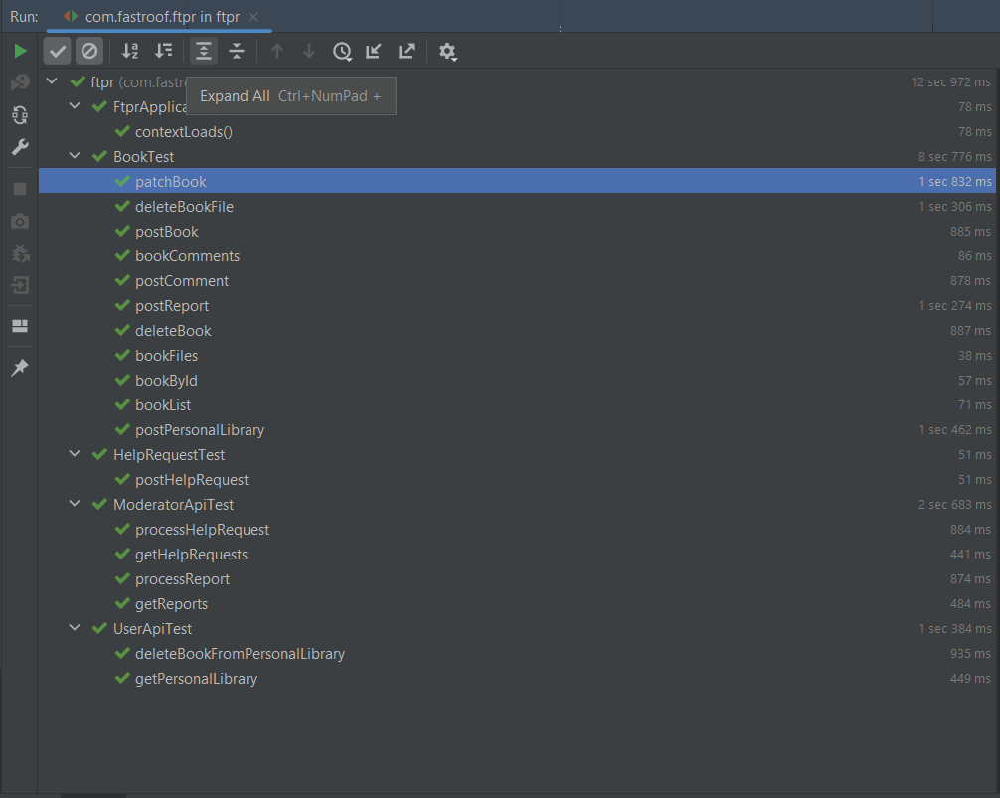


## Ручне тестування за допомогою Postman


### Реєстрація:
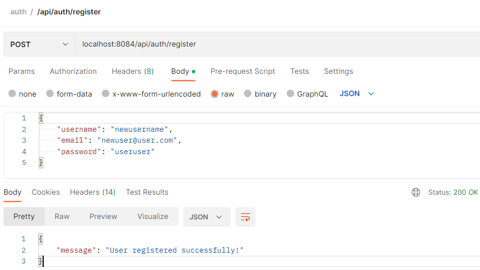

### Логін:

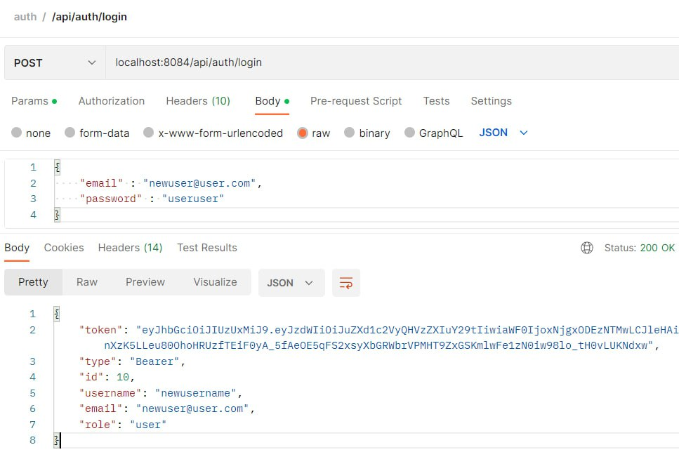

### Пост книги:

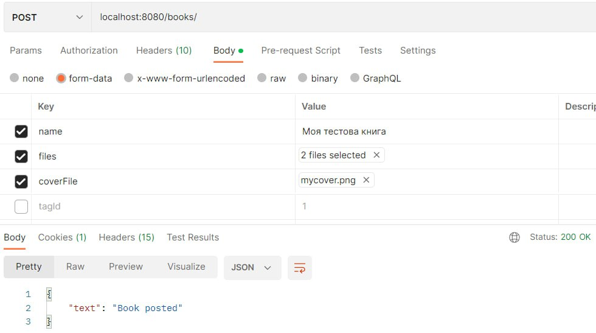

### Отримання книги по owner_id:

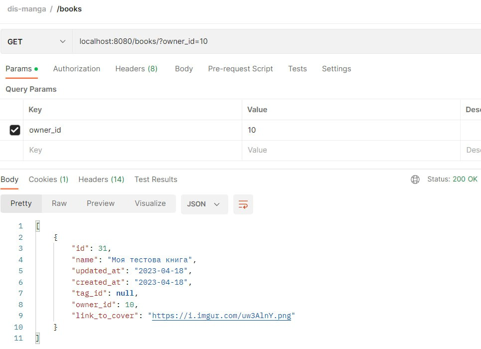

### Додавання тегу до книги(Patch):

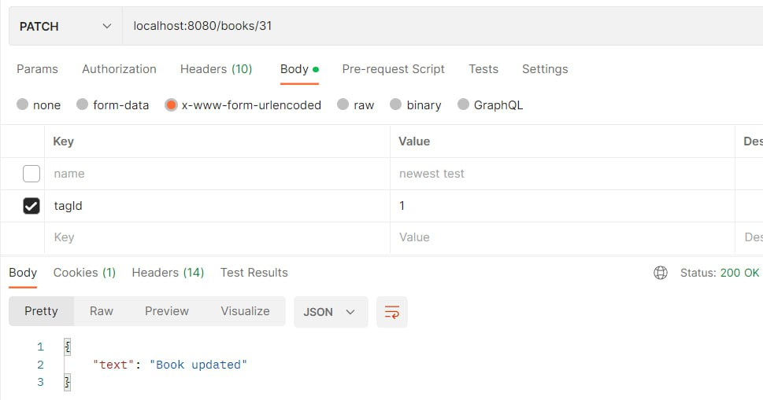

### Тег додано:

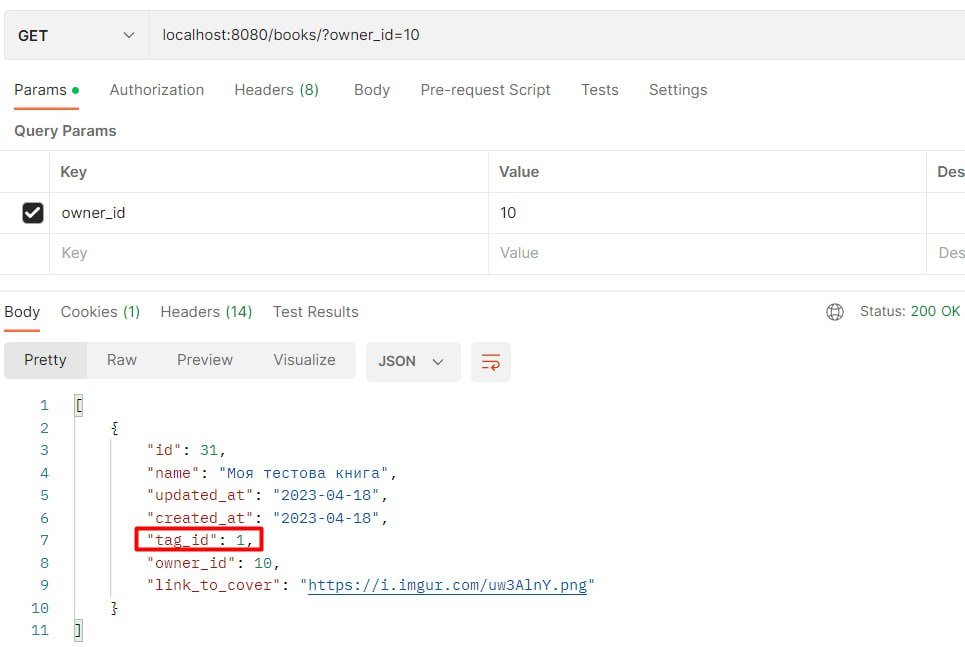

### Додавання книги до особистої бібліотеки:

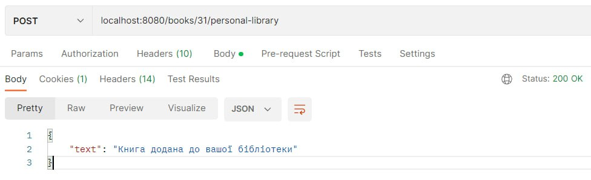

### Отримання книг в особистій бібліотеці:

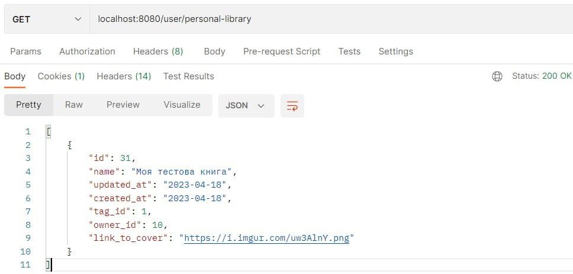

### Видалення книги:

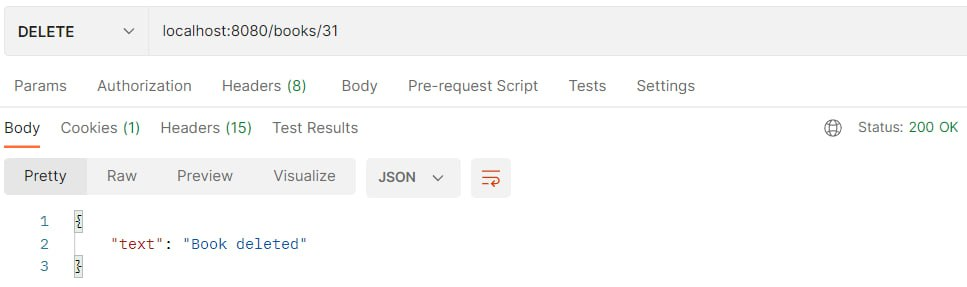

### Перевірка чи книга видалилась:

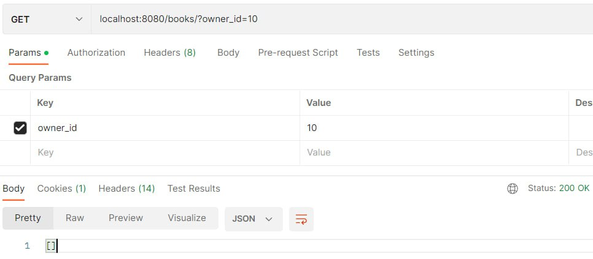
